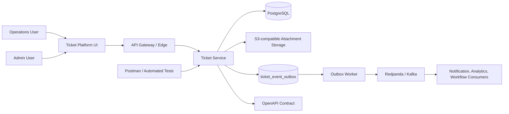
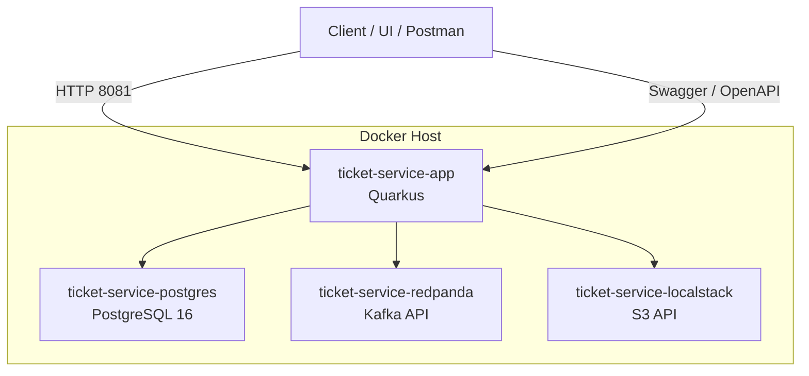
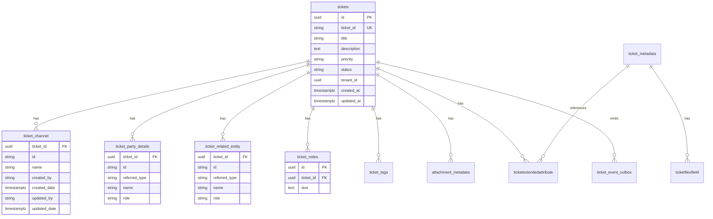
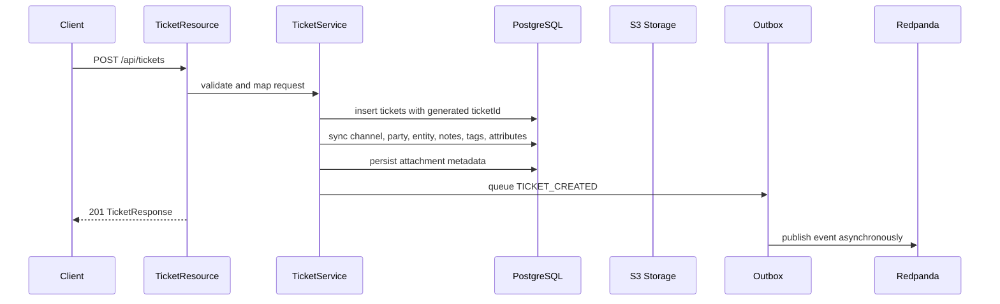
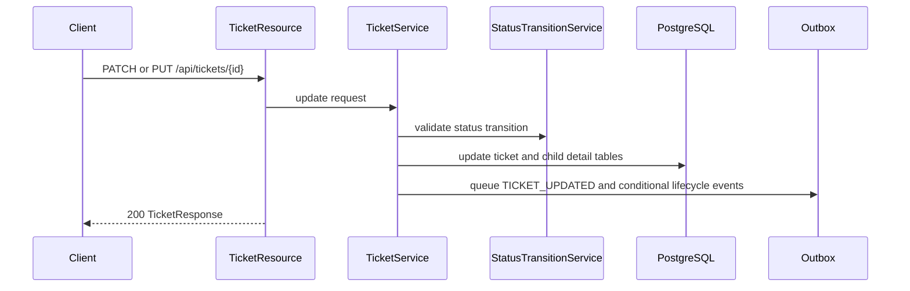

# Ticket Platform Overall Architecture Document

## Document Control

| Item | Value |
| --- | --- |
| Document | Overall Architecture Document |
| System | AxoCare Ticket Platform |
| Scope | Ticket service, platform integration boundaries, deployment, data, events, operations |
| Status | Production-ready baseline |
| Last Updated | 2026-05-29 |
| Primary Audience | Engineering, DevOps, QA, Security, Product |

## Executive Summary

The AxoCare Ticket Platform provides service request creation, lifecycle management, metadata configuration, attachment handling, and event publication for downstream operational systems. The current implementation is centered on a Quarkus-based ticket service backed by PostgreSQL, Flyway, Redpanda, and LocalStack-compatible S3 storage.

The platform is designed around durable database transactions, explicit status transition rules, transactional outbox publishing, API-first contracts, and operationally visible runtime components. The service can be deployed as a containerized microservice and integrated with future UI, identity, notification, analytics, and workflow services.

## Architecture Goals

- Provide reliable CRUD and listing APIs for service request tickets.
- Generate stable alphanumeric SR numbers through `ticketId` while preserving internal UUID identity.
- Capture rich ticket context through channel, related parties, related entities, notes, tags, attachments, and extended attributes.
- Keep metadata configurable through `ticket_meta`, `ticket_metadata`, `ticketflexifield`, and `ticketextendedattribute`.
- Publish lifecycle events to Redpanda/Kafka using an outbox pattern.
- Keep database schema evolution controlled by Flyway migrations.
- Maintain production readiness through health checks, automated tests, Docker deployment, and clear operational boundaries.

## Current Technology Stack

| Layer | Technology |
| --- | --- |
| Runtime | Java 17 |
| Framework | Quarkus 3.34 |
| API | JAX-RS / Quarkus REST Jackson |
| Validation | Hibernate Validator |
| Persistence | Hibernate ORM Panache |
| Database | PostgreSQL 16 |
| Migration | Flyway |
| Event Broker | Redpanda Kafka-compatible broker |
| Event Client | SmallRye Reactive Messaging |
| Object Storage | LocalStack S3-compatible API |
| Documentation | SmallRye OpenAPI, Markdown, Postman |
| Packaging | Docker, Docker Compose |
| Test | Quarkus Test, REST Assured |

## System Context

## Container Architecture

## Component Responsibilities

| Component | Responsibility |
| --- | --- |
| `TicketResource` | Ticket create, read, list, update, patch, delete, and batch lookup APIs |
| `TicketAttachmentResource` | Attachment upload, download, and delete APIs |
| `TicketMetaResource` | Metadata field configuration APIs |
| `TicketMetadataResource` | Metadata value APIs with active-field validation |
| `TicketService` | Main orchestration for ticket lifecycle, child tables, attachments, tags, attributes, and event queueing |
| `TicketStatusTransitionService` | Validates configured status transitions and lifecycle timestamps |
| `AttachmentStorageService` | Stores and retrieves binary attachment files from S3-compatible storage |
| `TicketEventOutboxService` | Writes and publishes event outbox records |
| `TicketEventOutboxWorker` | Scheduled worker for pending/error event publication |
| Repository layer | Panache repositories for persistence and query isolation |
| Flyway migrations | Versioned schema creation and upgrades |

## Logical Domain Model

## Runtime Request Flow

### Create Ticket

### Update Ticket

## API Architecture

The service exposes JSON REST APIs grouped by business capability.

| API Group | Endpoints |
| --- | --- |
| Tickets | `POST /api/tickets`, `GET /api/tickets`, `GET /api/tickets/{id}`, `POST /api/tickets/by-ids`, `PUT /api/tickets/{id}`, `PATCH /api/tickets/{id}`, `DELETE /api/tickets/{id}` |
| Attachments | `POST /api/tickets/{ticketId}/attachments/upload`, `GET /api/tickets/attachments/{attachmentId}/file`, `DELETE /api/tickets/attachments/{attachmentId}` |
| Metadata Config | `POST /ticket-meta`, `GET /ticket-meta`, `PUT /ticket-meta/{id}`, `DELETE /ticket-meta/{id}` |
| Metadata Data | `POST /ticket-metadata`, `GET /ticket-metadata`, `GET /ticket-metadata/{id}`, `PUT /ticket-metadata/{id}`, `DELETE /ticket-metadata/{id}` |

## Data Architecture

### Ticket Identity

The platform uses two ticket identifiers:

- `id`: internal UUID primary key, used for API path operations and database relationships.
- `ticketId`: external alphanumeric SR number, generated automatically and returned in create/get/list/by-ids responses and Redpanda event payloads.

### Child Detail Persistence

Ticket child details are normalized into dedicated tables:

- `ticket_channel`
- `ticket_party_details`
- `ticket_related_entity`
- `ticket_notes`

Child audit values are derived during create and update:

- `created_by`: `relatedParty` record with role `creator`
- `updated_by`: `relatedParty` record with role `updatedBy`
- `created_date`: ticket `creationDate`
- `updated_date`: ticket `lastUpdate`

### Metadata Model

Metadata configuration and data are split:

- `ticket_meta`: active metadata field configuration with `name`, `displayName`, audit, and active state.
- `ticket_metadata`: metadata values for category, subcategory, title, source, priority, and SLA.
- `ticketflexifield`: custom flexible fields attached to a metadata record.
- `ticketextendedattribute`: custom attributes attached to a ticket, optionally referencing metadata.

## Event Architecture

Events use a transactional outbox design:

1. Ticket API transaction writes the ticket mutation.
2. The same transaction writes one or more `ticket_event_outbox` rows.
3. The scheduled worker polls pending/error records.
4. Successful publication marks records as `PUBLISHED`.
5. Failed publication marks records as `ERROR`, stores `last_error`, and increments `retry_count`.

Supported events:

- `TICKET_CREATED`
- `TICKET_UPDATED`
- `TICKET_ASSIGNED`
- `TICKET_STATUS_CHANGED`
- `TICKET_RESOLVED`

Event payloads include the full `TicketResponse`, including ticket identity, channel, related parties, related entities, notes, tags, attachments, extended attributes, timestamps, and metadata-facing values.

## Deployment Architecture

### Local and Container Deployment

`docker-compose.yml` starts:

- `ticket-service-postgres`
- `ticket-service-redpanda`
- `ticket-service-localstack`
- `ticket-service-app`

The application container runs on port `8081`, PostgreSQL on `5432`, Redpanda on `19092`, and LocalStack S3 on `4566`.

### Production Deployment Recommendation

For production, deploy the service as a stateless container behind an API gateway or ingress. Use managed PostgreSQL, managed Kafka-compatible infrastructure, and durable object storage where possible.

| Concern | Recommendation |
| --- | --- |
| Compute | Kubernetes Deployment or equivalent container platform |
| Database | Managed PostgreSQL with backups, PITR, encryption, and read replicas if needed |
| Broker | Managed Kafka or Redpanda cluster with topic retention policy |
| Object Storage | S3-compatible bucket with lifecycle policy and encryption |
| Secrets | External secret manager, not environment files |
| Observability | Metrics, structured logs, tracing, health endpoints |
| Scaling | Horizontal application replicas; single database writer model |

## Security Architecture

Current service-level controls should be integrated with platform security before internet exposure.

Production security requirements:

- Terminate TLS at ingress or gateway.
- Enforce authentication through OIDC/OAuth2 provider.
- Enforce role-based access control for ticket agents, admins, and read-only users.
- Validate tenant access on every ticket and metadata operation.
- Store secrets in a secret manager.
- Enable encryption at rest for PostgreSQL and object storage.
- Sanitize and validate uploaded attachment metadata and file types.
- Use audit logging for create, update, delete, upload, and metadata configuration changes.

## Observability and Operations

Required production telemetry:

- API request count, latency, and error rate.
- Database connection pool utilization.
- Flyway migration status.
- Outbox pending/error counts.
- Kafka publish success/failure counts.
- Attachment upload/download/delete metrics.
- JVM heap, CPU, GC, and thread metrics.
- Business metrics such as tickets by status, priority, channel, SLA risk, and assignment queue.

Health endpoints:

- `/q/health`
- `/q/health/live`
- `/q/health/ready`

## Reliability and Failure Handling

| Failure | Expected Behavior |
| --- | --- |
| PostgreSQL unavailable | API fails fast, readiness reports down |
| Redpanda unavailable | Ticket transactions still persist; outbox retries later |
| S3 unavailable during upload | Upload fails; ticket metadata remains consistent |
| Consumer failure | Broker retention allows replay by downstream service |
| Duplicate client retry | Use client-side idempotency or external references for future hardening |
| Invalid status transition | API returns conflict and does not mutate ticket |

## Scalability Model

The service is stateless and can scale horizontally. PostgreSQL remains the source of truth. The outbox worker can run on multiple service instances if row selection and locking are designed to avoid duplicate publication; confirm worker locking behavior before large-scale multi-replica production rollout.

Primary scaling levers:

- Increase app replicas.
- Tune JDBC pool size per instance.
- Add indexes for high-cardinality search filters.
- Partition or archive historical tickets if volume grows substantially.
- Tune Kafka batch and outbox poll intervals.

## Non-Functional Requirements

| Category | Requirement |
| --- | --- |
| Availability | Service should support rolling deployment with no data loss |
| Performance | List APIs should be paginated and capped at configured maximum page size |
| Consistency | Ticket mutation and event enqueueing must be in the same transaction |
| Durability | Ticket, metadata, attachment metadata, and outbox rows must survive restart |
| Auditability | Ticket and child-table audit timestamps must be preserved |
| Operability | Health checks, logs, and testable deployment should be available |
| Compatibility | API responses must preserve existing `id` while adding `ticketId` |

## Testing Strategy

Current automated integration coverage validates:

- Ticket create, get, list, by-ids, patch, put, and soft delete.
- Category and subcategory behavior.
- Generated `ticketId`.
- Channel, related party, related entity, and notes.
- Attachment metadata and S3-backed upload/download/delete.
- Extended attributes.
- Metadata configuration and metadata record CRUD.
- Flexi fields.
- Status transition validation.
- Outbox event publication.

Recommended additional production tests:

- Security authorization tests.
- Contract tests generated from OpenAPI.
- Load tests for list/search and outbox publish throughput.
- Migration tests from prior production schema versions.
- Disaster recovery restore test for PostgreSQL and object storage.

## Environment Configuration

Key runtime configuration is held in `src/main/resources/application.properties` and environment variables:

- HTTP host and port.
- Datasource URL, username, password, and pool size.
- Flyway migration flag.
- Kafka bootstrap servers and topic.
- S3 endpoint, region, credentials, and bucket name.
- Attachment download base path.
- Outbox poll interval and batch size.
- Status transition config location.

## Open Risks and Recommendations

| Risk | Recommendation |
| --- | --- |
| No dedicated API gateway defined in this repository | Place service behind gateway/ingress for auth, rate limiting, TLS, and routing |
| UI code is not present in this backend repository | Build UI as a separate frontend app using generated OpenAPI client |
| Free-text search is database-backed | Add full-text indexes or search service if ticket volume grows |
| Attachment virus scanning is not represented | Add malware scanning workflow before exposing attachments broadly |
| Multi-tenant authorization is not visible in code | Add tenant enforcement at service/resource boundary |
| Event replay contract needs consumer ownership | Publish event schema versioning and consumer compatibility rules |

## Production Readiness Checklist

- Container image builds successfully.
- Flyway migrations run at startup.
- Integration tests pass.
- OpenAPI documentation is generated and committed.
- Postman collection is updated.
- Health endpoint reports UP.
- Database backup and restore procedures exist.
- Kafka topic retention and partitions are configured.
- S3 bucket lifecycle and encryption are configured.
- Secrets are managed outside source control.
- Logging and metrics are connected to central observability tooling.
