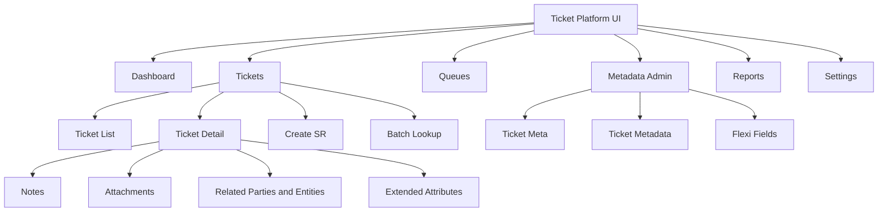
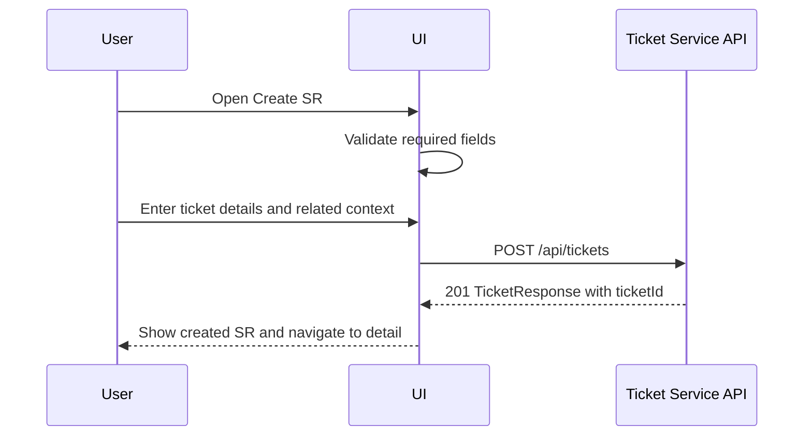
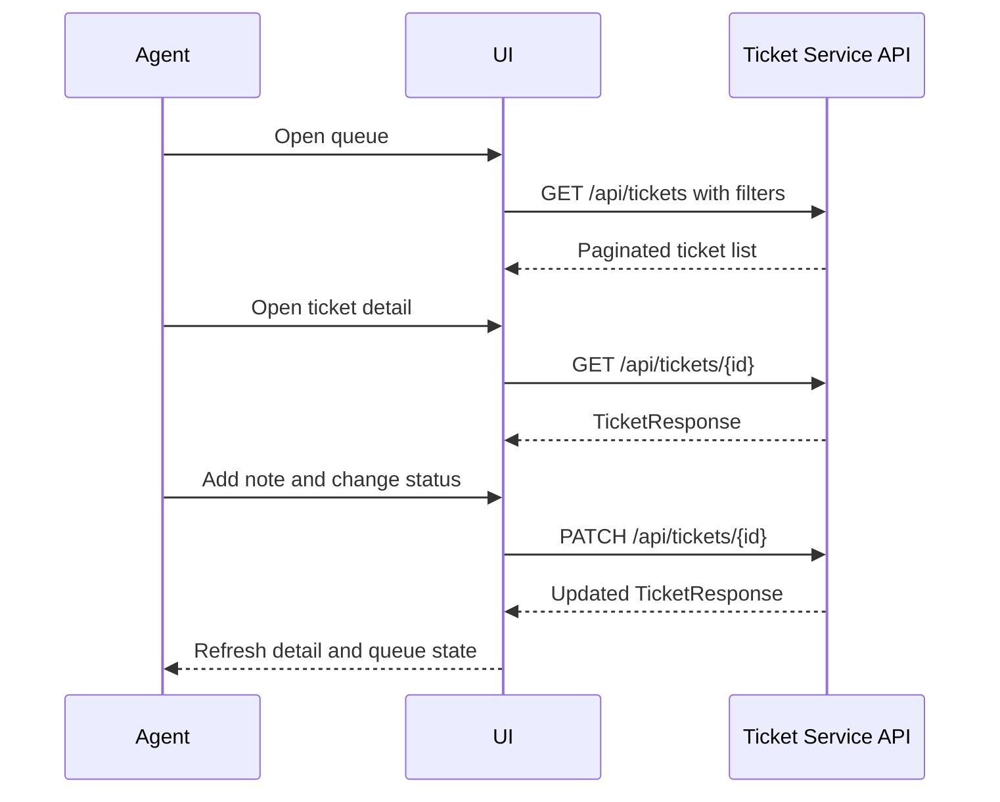

# Ticket Platform UI Design Document

## Document Control

| Item | Value |
| --- | --- |
| Document | UI Design Document |
| System | AxoCare Ticket Platform UI |
| Scope | User experience, feature set, screens, interaction model, frontend tech stack |
| Status | Production-ready design baseline |
| Last Updated | 2026-05-29 |
| Primary Audience | Product, UI Engineering, QA, UX, Backend Engineering |

## Purpose

This document defines the target user interface for the AxoCare Ticket Platform. It covers the UI structure, features, user journeys, visual design, interaction design, technical stack, integration points, accessibility, testing, and production readiness expectations.

The current repository contains the backend ticket service. The UI described here is a production-grade frontend design intended to consume the ticket service APIs and event-backed ticket payloads.

## UI Product Vision

The UI should help support teams create, triage, update, monitor, and resolve service requests quickly. It should feel operational, dense, predictable, and calm. The main screen should prioritize work queue visibility, SLA risk, ticket ownership, and fast navigation to ticket details.

## Design Principles

- Operational first: expose ticket queues, SLA risk, and next action before decorative content.
- Fast scanning: use consistent table density, strong status labels, and predictable filters.
- Low-friction updates: common actions such as status change, assignment, notes, and attachment review should be available without deep navigation.
- Audit visible: show creation, update, channel, related parties, and notes clearly.
- Configurable metadata: support category, subcategory, source, priority, SLA, flexi fields, and extended attributes.
- Accessible by default: keyboard navigation, focus states, semantic structure, adequate contrast, and screen reader labels.
- API-first: frontend contracts should be generated or validated from OpenAPI.

## Target Users

| Persona | Primary Goals |
| --- | --- |
| Service Agent | Work assigned tickets, add notes, update status, attach evidence, resolve issues |
| Queue Manager | Monitor workload, rebalance assignments, track SLA risk, inspect bottlenecks |
| Metadata Admin | Configure metadata fields, categories, SLA options, flexi fields |
| Support Lead | Review escalations, validate operational quality, monitor reports |
| Read-only Stakeholder | Search and inspect SR status and history |

## UI Screens

### Dashboard


The dashboard is the primary landing screen for operations users. It combines high-signal metrics, queue visibility, SLA alerts, and direct navigation to ticket records.

Core dashboard capabilities:

- Open ticket count.
- SLA-at-risk count.
- Resolved-today count.
- Average first response time.
- Active work queue.
- Search by SR number, account, customer, title, or external reference.
- Quick filters for status, priority, queue, category, subcategory, channel, and tenant.
- SLA timeline and escalation recommendations.
- Direct row navigation to ticket detail.

### Ticket Detail


The ticket detail screen is the main workspace for a service request. It should support fast comprehension and controlled updates.

Core ticket detail capabilities:

- Header with `ticketId`, title, status, priority, and primary actions.
- Summary section with description, category, subcategory, channel, tenant, timestamps, and SLA.
- Related parties with role and referred type.
- Related entities such as customer account or asset.
- Notes timeline.
- Attachments list with file type, size, download, and delete actions.
- Extended attributes and flexi fields.
- Status transition action constrained by backend rules.
- Audit timeline for create, update, assignment, and resolution.

## Information Architecture



## Key Features

### Ticket Management

- Create SR tickets with title, description, category, subcategory, channel, related parties, related entities, notes, tags, attachments, and extended attributes.
- Display generated alphanumeric `ticketId` after creation.
- Read ticket by internal UUID.
- Search and list tickets with filters.
- Batch lookup tickets by UUID list.
- Patch partial fields.
- Replace full ticket payload.
- Soft delete ticket.
- Respect backend status transition rules.

### Queue and SLA Management

- Queue-level ticket list by status, priority, category, team, assignee, and tenant.
- SLA risk indicators using metadata `sla` and ticket timestamps.
- Sort by created date, updated date, priority, status, title, category, subcategory, and `ticketId`.
- Highlight tickets near breach.
- Show first-response and resolution timing indicators.

### Ticket Context

- Channel card: `id`, `name`, created by, updated by, created date, updated date.
- Related party list: `id`, `name`, `role`, `@referredType`.
- Related entity list: `id`, `name`, `role`, `@referredType`.
- Notes timeline with create/update audit fields.
- Tags and extended attributes.
- Attachment metadata and file operations.

### Metadata Administration

- Configure metadata fields through `ticket_meta`.
- Set `displayName` for UI labels.
- Toggle metadata active/inactive state.
- Manage metadata values for category, subcategory, title, source, priority, and SLA.
- Manage flexi fields attached to metadata records.
- Prevent users from selecting inactive or unconfigured fields.

### Attachment Management

- Upload file against a ticket.
- Display attachment file name, content type, size, created date, and download URL.
- Download file.
- Delete attachment.
- Show upload errors with actionable user feedback.

### Event Awareness

The UI should not directly consume Redpanda events in the initial design. Instead, it should use REST APIs for authoritative views. Future enhancement can add websocket or server-sent event notification service that consumes ticket events and pushes real-time updates to UI clients.

## User Journeys

### Create SR Journey



### Work Ticket Journey



## Layout Model

### Global Shell

- Left navigation for major modules.
- Header with search, tenant context, notifications, and user profile.
- Main content area with responsive container.
- Optional right-side insights panel for SLA, activity, or metadata help.

### Dashboard Layout

- Top metric cards for operational KPIs.
- Main work queue table.
- Side panel for SLA timeline and alerts.
- Persistent filters above table.
- Quick create button.

### Ticket Detail Layout

- Sticky header with `ticketId`, title, status, priority, and actions.
- Main left column for summary, parties, entities, notes, and extended attributes.
- Right column for SLA, attachments, metadata, and audit timeline.
- Inline edit for low-risk fields.
- Confirmation dialog for destructive actions.

## Component Inventory

| Component | Purpose |
| --- | --- |
| AppShell | Navigation, header, responsive layout |
| TicketTable | Paginated ticket queue and list |
| TicketFilters | Status, priority, tenant, user, team, source, category, subcategory, ticketId, search |
| TicketCreateForm | SR creation form |
| TicketDetailHeader | SR identity, status, priority, actions |
| StatusBadge | Standard status rendering |
| PriorityBadge | Standard priority rendering |
| ChannelCard | Ticket channel details |
| RelatedPartyList | Related parties and audit source |
| RelatedEntityList | Customer/account/entity context |
| NotesTimeline | Ticket notes and audit dates |
| AttachmentPanel | Upload, download, delete, metadata display |
| ExtendedAttributesPanel | Custom ticket attributes |
| MetadataAdminTable | `ticket_meta` management |
| MetadataRecordForm | `ticket_metadata` and flexi fields |
| ConfirmDialog | Delete and irreversible actions |
| Toast | Success and error feedback |

## Form Design

### Create Ticket Form Sections

1. Basic details: title, description, priority, status, tenant.
2. Classification: category, subcategory, source, SLA.
3. Channel: channel id and name.
4. Related parties: creator, updatedBy, affected user, owner.
5. Related entities: customer account, asset, subscription, service.
6. Notes: initial note.
7. Tags.
8. Attachments metadata.
9. Extended attributes.

### Validation Rules

- Required fields should be validated client-side and server-side.
- `title` max length should follow backend constraints.
- Status and priority should use controlled enums.
- Date/time values should be sent as ISO-8601 UTC.
- Related party roles should include `creator` on create.
- `updatedBy` should be included on update when available.
- Metadata dropdowns should show only active configured values.

## Frontend Tech Stack

Recommended production frontend stack:

| Concern | Recommended Technology |
| --- | --- |
| Language | TypeScript |
| Framework | React 18 |
| Build Tool | Vite or Next.js, depending on routing and SSR needs |
| Routing | React Router or Next.js App Router |
| Data Fetching | TanStack Query |
| API Client | OpenAPI-generated TypeScript client |
| Forms | React Hook Form |
| Schema Validation | Zod |
| State | URL state for filters, TanStack Query cache for server state, lightweight store for UI preferences |
| Styling | CSS modules, Tailwind CSS, or design-system tokens |
| Tables | TanStack Table |
| Icons | Lucide React |
| Charts | Recharts or ECharts |
| Testing | Vitest, React Testing Library, Playwright |
| Accessibility | axe-core, eslint-plugin-jsx-a11y |
| Quality | ESLint, Prettier, TypeScript strict mode |
| CI | Build, lint, unit tests, Playwright smoke, bundle analysis |

## Backend Integration

The UI should consume the ticket service as an API-first backend.

| UI Need | API |
| --- | --- |
| Create ticket | `POST /api/tickets` |
| Ticket detail | `GET /api/tickets/{id}` |
| Ticket queue | `GET /api/tickets` |
| Batch lookup | `POST /api/tickets/by-ids` |
| Patch ticket | `PATCH /api/tickets/{id}` |
| Replace ticket | `PUT /api/tickets/{id}` |
| Delete ticket | `DELETE /api/tickets/{id}` |
| Upload attachment | `POST /api/tickets/{ticketId}/attachments/upload` |
| Download attachment | `GET /api/tickets/attachments/{attachmentId}/file` |
| Delete attachment | `DELETE /api/tickets/attachments/{attachmentId}` |
| Metadata config | `/ticket-meta` |
| Metadata values | `/ticket-metadata` |

## API Client Model

Recommended API client structure:

```text
src/
  api/
    generated/
    ticketClient.ts
    queryKeys.ts
  features/
    tickets/
    metadata/
    attachments/
  components/
  layouts/
  routes/
```

Use generated types from `docs/swagger-openapi.yaml` to reduce drift between frontend and backend. Query keys should be structured and stable, for example:

```text
["tickets", "list", filters]
["tickets", "detail", ticketUuid]
["ticket-meta", "list"]
["ticket-metadata", "detail", metadataId]
```

## UX States

Every production screen should define:

- Loading state.
- Empty state.
- Error state.
- Permission denied state.
- Offline or retry state where applicable.
- Dirty form state.
- Optimistic or pending mutation state.
- Success confirmation.

## Accessibility Requirements

- Use semantic headings and landmarks.
- Ensure all icon buttons have accessible labels.
- Provide keyboard access to filters, tables, dialogs, tabs, and forms.
- Preserve focus after modal close and after successful mutation.
- Use visible focus rings.
- Keep color contrast at WCAG AA or better.
- Do not rely on color alone for status or priority.
- Provide descriptive text for attachments and download actions.

## Responsive Behavior

| Breakpoint | Behavior |
| --- | --- |
| Desktop | Full sidebar, metrics, table, and detail side panel |
| Tablet | Collapsible sidebar, simplified metric row, stacked detail panels |
| Mobile | Drawer navigation, card-based ticket list, critical fields first |

The operations experience is primarily desktop-first because agents need table scanning, multi-column filtering, and ticket-detail comparison. Mobile should support quick status checks and simple note/status updates.

## Security Requirements

The UI should be integrated with the platform identity provider.

- Use OIDC authorization code flow with PKCE.
- Store tokens securely according to selected platform standards.
- Apply route guards for admin and user screens.
- Hide controls the user cannot execute.
- Still rely on backend authorization for enforcement.
- Include tenant context in API calls where required.
- Never expose secrets in frontend environment variables.

## Observability Requirements

The UI should emit:

- Page load metrics.
- API latency and error metrics.
- Client-side exception telemetry.
- User flow analytics for create, update, upload, and resolve.
- Feature usage for filters, metadata admin, and SLA views.

Avoid sending PII or sensitive ticket content to analytics by default.

## Performance Requirements

- Initial route should load within acceptable enterprise web performance budgets.
- Ticket list must be server-paginated.
- Filters should update URL state and avoid unbounded client-side filtering.
- Large notes and attachments should be lazy-loaded or paginated if required.
- Use code splitting for metadata admin and reporting screens.
- Cache stable metadata lists with controlled invalidation.

## Error Handling

| Error Source | UI Behavior |
| --- | --- |
| Validation error | Highlight field and show backend message |
| Invalid status transition | Show conflict message and refresh latest ticket |
| Ticket not found | Show not-found page and link back to queue |
| Attachment upload failure | Keep form state and offer retry |
| Network failure | Show retry action and non-destructive message |
| Unauthorized | Redirect to login or show access denied |

## Testing Strategy

### Unit Tests

- Utility functions.
- API mappers.
- Form validation.
- Component rendering.

### Integration Tests

- Ticket create form submission.
- Ticket list filtering.
- Ticket detail patch/update.
- Metadata admin CRUD.
- Attachment upload/download/delete flows.

### End-to-End Tests

- Create SR and verify `ticketId`.
- Patch ticket to `IN_PROGRESS`.
- Replace ticket payload.
- Resolve ticket.
- Upload and delete attachment.
- Configure metadata and validate dropdown changes.

### Visual Regression

- Dashboard.
- Ticket list.
- Ticket detail.
- Create SR form.
- Metadata admin.
- Error and empty states.

## Production Readiness Checklist

- OpenAPI-generated client is checked into build or generated in CI.
- TypeScript strict mode passes.
- Lint passes.
- Unit and integration tests pass.
- Playwright smoke suite passes against deployed backend.
- Accessibility scan passes core screens.
- Bundle size report is reviewed.
- Environment config is documented.
- Error monitoring is connected.
- Auth flow is validated.
- API timeout and retry policies are implemented.
- UI release version is visible for support.

## Future Enhancements

- Real-time ticket updates through websocket or server-sent events.
- Advanced SLA calendar support for business hours and holidays.
- Bulk assignment and bulk status updates.
- Saved views for agents and managers.
- Advanced analytics dashboards.
- Attachment preview with malware scan status.
- Workflow automation recommendations.
- AI-assisted summarization for long note history.
